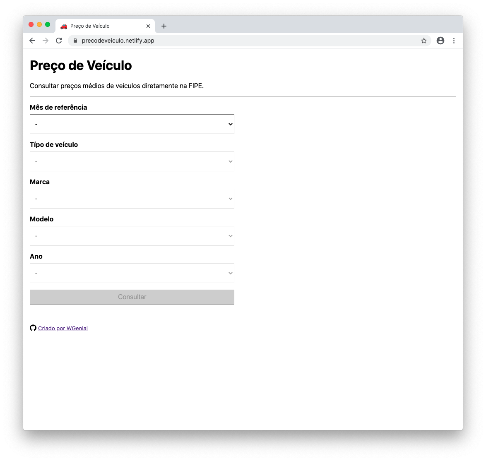
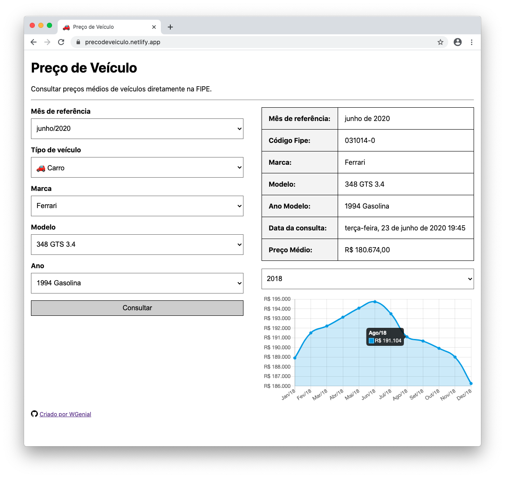

# Preço de Veículo
App para consultar preços médios de veículos diretamente na FIPE.

## Demo

| **Netlify** | **Vercel** |
|:-----:|:-----:|
| [https://precodeveiculo.netlify.app](https://precodeveiculo.netlify.app) |
 [https://precodeveiculo.vercel.app](https://precodeveiculo.vercel.app) |
| [] |
 []



## Docker

Para rodar a aplicação basta executar no terminal

```
docker-compose up -d
```

Pronto, agora acesse http://localhost:3000

Mais informações sobre `docker-compose` acesse
https://docs.docker.com/compose/reference

## Autor

- [(https://github.com/GabrielLeme05)]
